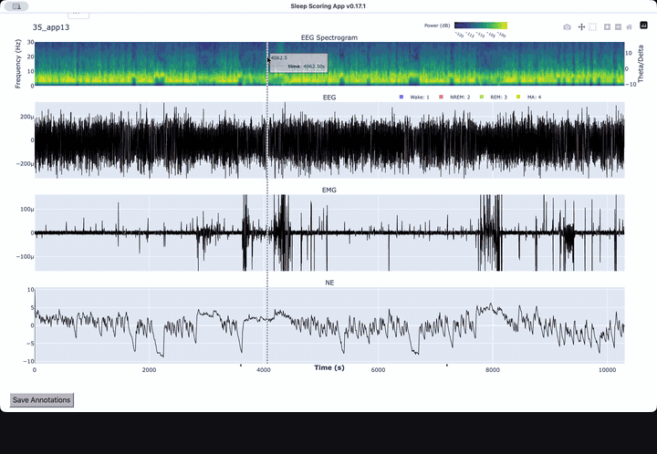

# Sleep Scoring

[](https://github.com/yzhaoinuw/agent_collab_treaty)
[](https://doi.org/10.5281/zenodo.21748494)

<p align="center">
  
</p>

A desktop app for viewing EEG, EMG, and optional norepinephrine (NE) signals,
manually annotating sleep scores (also known as sleep stages), checking
aligned video, and optionally generating automatic sleep scores.

## Contents

- [Install](#install)
- [Before Your First Session](#before-your-first-session)
- [Use The App](#use-the-app)
- [App Updates](#app-updates)
- [Optional sDREAMER Model](#optional-sdreamer-model)
- [Input Files](#input-files)
- [Developer Documentation](#developer-documentation)
- [Citation](#citation)
- [Funding](#funding)

## Install

| You are... | Install | What you need |
| --- | --- | --- |
| A Windows user who just wants to run the app | [Packaged Windows app](#packaged-windows-app) | A web browser |
| A Windows user who wants to inspect or modify the code | [Run from source](#run-from-source-windows-or-macos) | Git and Miniconda |
| A macOS user | [Run from source](#run-from-source-windows-or-macos) | Git and Miniconda; no packaged macOS build yet, tested on macOS Tahoe |
| A contributor | [Run from source](#run-from-source-windows-or-macos) | Git, Miniconda, and the checks in [CONTRIBUTING.md](CONTRIBUTING.md) |

### Packaged Windows App

1. From the latest
   [release](https://github.com/yzhaoinuw/sleep_scoring/releases), download the
   ZIP whose name ends in `_full.zip`. Not the **Source code** archives —
   those are not the app.
2. Extract it and move the app folder wherever you want to keep it.
3. Double-click `unblock_app.cmd`. It unblocks the downloaded files and starts
   the app.

<details>
<summary>Troubleshoot the extracted folder layout</summary>

The app folder should directly contain `_internal/`, `app_src/`, `models/`,
`unblock_app.cmd`, and `run_desktop_app.exe`.

Windows' **Extract All** creates a wrapper folder named after the ZIP and puts
the app folder inside it, leaving you one level deeper than you expect. Move
the inner `sleep_scoring_app_vX.Y` folder where you want it and delete the
wrapper.

</details>

### Run From Source (Windows Or macOS)

Install [Git](https://git-scm.com/book/en/v2/Getting-Started-Installing-Git)
and [Miniconda](https://docs.conda.io/projects/miniconda/en/latest/miniconda-install.html),
then run:

```bash
git clone https://github.com/yzhaoinuw/sleep_scoring.git
cd sleep_scoring
conda env create -f environment.yml
conda activate sleep_scoring_dash3.0
python run_desktop_app.py
```

Activate the environment again in each new terminal. To update:

```bash
git pull
conda env update -f environment.yml
```

## Before Your First Session

- Run the packaged app from a local folder, not a cloud-synced folder, network
  drive, or the ZIP itself.
- You can open up to three windows, but not the same `.mat` file in two of them.
- If the graph feels slow, close other browser tabs and heavy applications.

## Use The App

https://github.com/user-attachments/assets/48d4a954-ede9-4dcb-9299-9702263d2057

### Start The App And Open A Recording

- **Packaged Windows app:** the first time, double-click `unblock_app.cmd`.
  Afterwards, double-click `run_desktop_app.exe`.
- **Source installation:** activate the Conda environment and run
  `python run_desktop_app.py`.

Select a `.mat` file to visualize its EEG, EMG, and NE signals, if present.

### Switch Between Modes

Press <kbd>M</kbd> to switch between:

- **Navigation mode:** pan and zoom the plots.
- **Annotation mode:** select time ranges and assign sleep scores.

### Navigate And Zoom

Every newly opened recording starts in navigation mode.

- Drag left or right on a plot to pan horizontally, or use the left and right
  arrow keys.
- Drag vertically on the EEG or EMG plot to pan its Y-axis.
- Scroll over a plot to zoom.
- Scroll over the spectrogram to zoom only the X-axis.
- Scroll just to the left of a Y-axis to zoom only that axis.
- Use **Reset Axes** in the graph's upper-right mode bar to restore the view.

The spectrogram Y-axis is fixed. To lock the NE Y-axis too, set
`FIX_NE_Y_RANGE = True` in `app_src/config.py`.

### Annotate Sleep Scores

In annotation mode:

- Click to select a thin strip, then press <kbd>1</kbd> for Wake,
  <kbd>2</kbd> for NREM, <kbd>3</kbd> for REM, or <kbd>4</kbd> for MA.
- Press <kbd>0</kbd> on a selected range to clear its score.
- Drag a box to select a wider region. Dragging beyond the visible edge
  auto-pans the graph so you can continue the selection.
- Right-click inside a scored or unscored segment to select that entire
  contiguous segment.
- Use **Undo Annotation** below the graph to undo the most recent annotation.

### Check Aligned Video

https://github.com/user-attachments/assets/2a650d69-95f0-4b25-af85-3000641ae304

In annotation mode, select a region shorter than 300 seconds and click
**Check Video** above the graph.

The first time, the app may ask you to locate the matching `.avi`. If
[preprocessing](https://github.com/yzhaoinuw/preprocess_sleep_data) already
found it, the app shows that path.

### Generate Automatic Scores

https://github.com/user-attachments/assets/47ba95ca-c7aa-49fd-bf25-659e290bbdb4

In annotation mode, click **Generate Predictions**. Scoring runs in the
background; when it finishes, correct it manually or undo it. Manual labels
remain in place when you generate scores again.

The statistical model is the default and needs no extra setup. To use
[sDREAMER](#optional-sdreamer-model) instead, change the backend in
`app_src/config.py`:

```python
SLEEP_SCORING_MODEL = "stats_model"  # or "sdreamer"
```

The statistical model is tuned by three more settings in the same file:
`STATS_MODEL_WAKE_THRESHOLD`, `STATS_MODEL_MIN_WAKE_DURATION`, and
`STATS_MODEL_MIN_REM_DURATION`.

For the statistical model, the labels you add in the current recording also
adapt its Wake/REM configuration live for the next prediction. One or more
Wake, NREM, or REM examples are enough; the app chooses the closest matching
configuration for that recording without editing `config.py`. The model fills
the remaining time, while your labels stay unchanged.

### Save Sleep Scores

Click **Save Annotations** at the lower left of the graph, then choose where to
write the `.mat` file.

If anything is still unscored, the app reports the first gap as
`[start, end] (duration s)`. Once the recording is fully scored, it also offers
to export sleep bouts and summary statistics to Excel.

### Use Multiple Windows And Crash Recovery

Launch the app again to open as many as three independent windows. The second
and third show `(2)` and `(3)` in their title bars.

- A recording already open in one window cannot be loaded in another.
- Video clips and saved video associations are isolated by window.
- Only the first window checks for app updates.
- Crash recovery is tied to window position. Relaunch windows in their original
  order and reopen the same recording in the matching position; opening a
  different file first clears that window's recovery state.

## App Updates

The packaged Windows app keeps itself current. It checks GitHub about once a
day and applies compatible updates before the window opens. If it cannot — no
network, or a local edit in the way — it says so in the terminal and opens
normally.

Some releases replace the whole package and cannot be applied automatically.
When the terminal reports one, download the new `_full.zip` and repeat the
[installation steps](#packaged-windows-app).

To check which version you are on, look at the startup terminal or the app
window title. The installation folder keeps its original `vX.Y` name even after
updates, so it is not a reliable indicator.

## Optional sDREAMER Model

sDREAMER is a bundled neural model, and is not needed for visualization,
annotation, video, saving, or the default statistical model. Its checkpoints
are not in this public repository; request them from Yue Zhao. See
[NOTICE](NOTICE) for provenance and citation.

1. Install PyTorch:
   - **Packaged app:** download `torch.zip` from the same release, extract it,
     and copy its contents into `_internal/` so that `_internal/torch/` exists.
   - **Source:** install the [build for your
     computer](https://pytorch.org/get-started/locally/), then run
     `pip install timm==1.0.22 einops==0.8.1`.
2. Put the checkpoint files in `models/sdreamer/checkpoints/`.
3. Set `SLEEP_SCORING_MODEL = "sdreamer"` in `app_src/config.py` and restart.

## Input Files

The app opens MATLAB `.mat` files produced from raw recordings by the
[preprocess_sleep_data](https://github.com/yzhaoinuw/preprocess_sleep_data)
workflow.

Required fields:

| Field | Type |
| --- | --- |
| `eeg` | 1 x *N* single |
| `eeg_frequency` | double |
| `emg` | 1 x *N* single |

<details>
<summary>Optional fields and timing details</summary>

| Field | Type |
| --- | --- |
| `ne` | 1 x *M* single |
| `ne_frequency` (alias: `fp_frequency`) | double |
| `sleep_scores` | single |
| `start_time` | double |
| `video_name` | char |
| `video_path` | char |
| `video_start_time` | double |

- `start_time` can be nonzero when a recording longer than 12 hours was split
  into shorter files.
- `video_path` is the `.avi` path found during preprocessing.
- `video_start_time` is the video TTL onset measured on the EEG acquisition
  side, such as Viewpoint or Pinnacle.

</details>

Sampling rates are read from the file, and EMG is assumed to match
`eeg_frequency`. The statistical model uses those rates directly; sDREAMER
resamples EEG/EMG to 512 Hz and expects NE at 10 Hz.

## Developer Documentation

- [CONTRIBUTING.md](CONTRIBUTING.md): contribution workflow, source setup, and
  checks
- [project_overview.md](project_overview.md): current architecture and
  repository boundaries
- [dash_app_cookbook.md](dash_app_cookbook.md): feature-by-feature
  implementation recipes
- [packaging/windows/README.md](packaging/windows/README.md): Windows release
  packaging and update assets
- [media/README.md](media/README.md): recording and rebuilding the demo clips
  on this page

## Citation

Use GitHub's **Cite this repository** button or
[CITATION.cff](CITATION.cff) for an APA or BibTeX entry.

Every release is archived on Zenodo. Cite the concept DOI
[10.5281/zenodo.21748494](https://doi.org/10.5281/zenodo.21748494), which
always resolves to the newest release; cite a release's own DOI only to pin the
exact version you ran.

A JOSS paper is in preparation in [paper/paper.md](paper/paper.md); cite it
instead once published.

Scores generated by sDREAMER need that model's own citation, in
[NOTICE](NOTICE).

## Funding

This work was supported by the BRAIN Initiative of the US National Institutes
of Health (U19NS128613).
